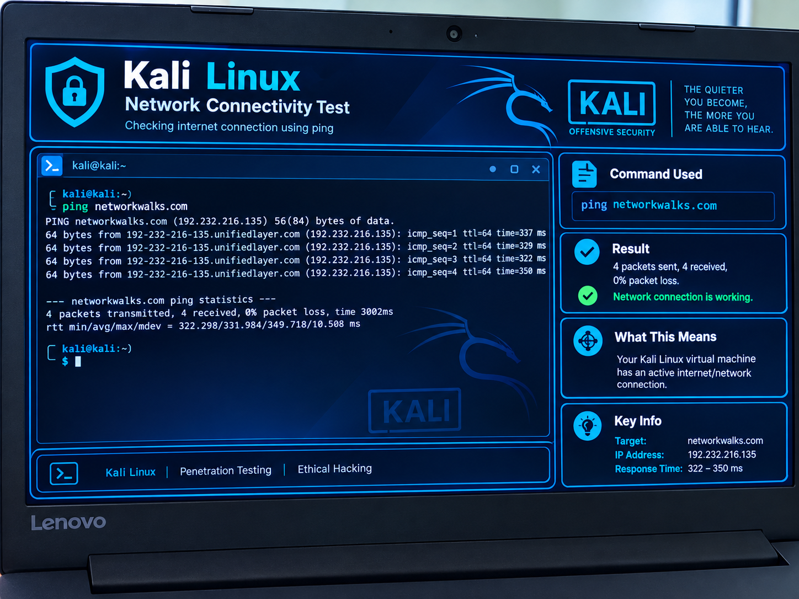
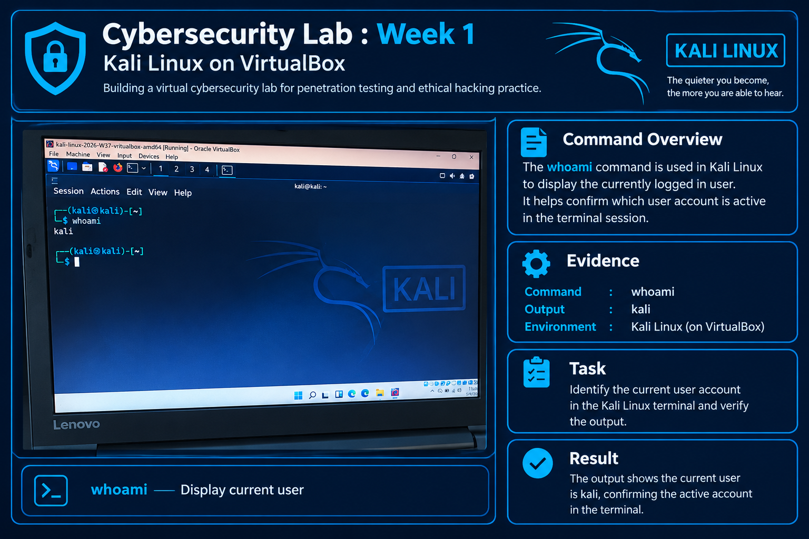
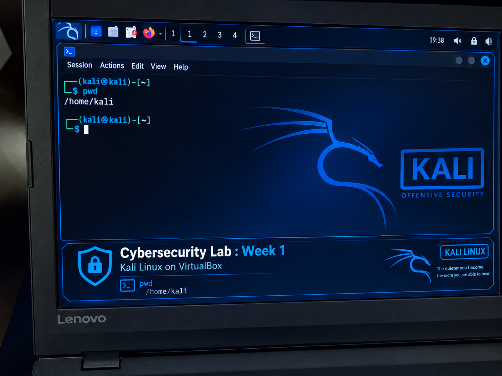

# Cybersecurity Week one-run Kali Linux for the first time in VirtualBox

# 🔐 Cybersecurity Lab : Week 1

## Kali Linux on VirtualBox

---

## 📌 Project Overview

This project documents my first practical cybersecurity laboratory exercise.

The objective is to build a virtual cybersecurity laboratory environment for penetration testing and ethical hacking practice by deploying **Kali Linux v2026.2** using **Oracle VirtualBox v7.2**.

The project provided practical experience with:

- Virtualization
- Kali Linux
- Linux system administration
- Networking
- Troubleshooting
  

The laboratory was performed on a **Lenovo laptop running Windows with 4 GB of RAM**.

---

## 🎯 Objectives

The main objectives of this project was to:

- Install and use VirtualBox
- Deploy Kali Linux in a virtual machine
- Configure virtual machine resources
- Start and access Kali Linux
- Check system information
- Test network connectivity
- Understand NAT networking

---

## 🔐 Cybersecurity Lab Environment

- **Skill:** Cybersecurity
- **VirtualBox:** 7.2
- **Kali Linux:** 2026.2

---

## 💻 Lab Environment

### 🖥️ Host Computer

| Component | Details |
|---|---|
| Computer | Lenovo Laptop |
| Model/Type | 81H5 |
| Host Operating System | Windows |
| RAM | 4 GB |

### 🐧 Virtual Machine

| Resource | Configuration |
|---|---|
| Operating System | Kali Linux v2026.2 |
| Virtualization Platform | Oracle VirtualBox v7.2 |
| Network Mode | NAT |
| RAM | Configured according to available host resources |
| CPU | Configured according to available host resources |
| Storage | Virtual disk |

---

# 🚀 Kali Linux Deployment

## Step 1 — VirtualBox Setup

VirtualBox v7.2 was used as the virtualization platform.

A virtual machine was created and configured for Kali Linux v2026.2.

The configuration included:

- Kali Linux v2026.2
- Virtual CPU resources
- Allocated RAM
- Virtual storage
- NAT networking

The resources were configured according to the available hardware of the host computer.

---

## Step 2 — Creating the Kali Linux Virtual Machine

The Kali Linux v2026.2 virtual machine was created in VirtualBox.

The VM was configured with:

- **Operating System:** Kali Linux v2026.2
- **Virtualization:** Oracle VirtualBox v7.2
- **Network:** NAT
- **Virtual RAM:** Configured according to available host resources
- **Virtual CPU:** Configured according to available host resources
- **Virtual Disk:** Virtual storage

---

## Step 3 — Starting Kali Linux

The virtual machine was started through VirtualBox.

Kali Linux began the boot process and loaded into the Linux desktop environment.

---

# 🐧 Linux System Validation

After starting Kali Linux, basic Linux terminal commands were used to validate the system.

## Check Current User

```bash
whoami
```

**Purpose:** Displays the username of the currently logged-in user.

---

# 🌐 Network Connectivity Testing

Network connectivity was tested from the Kali Linux virtual machine using:

```bash
ping -c 4 networkwalks.com
```

## Purpose

The `ping` command was used to test whether the Kali Linux virtual machine could communicate with an external internet host.

The `-c 4` option sends four packets.

## Result

The test was used to verify network connectivity through the VirtualBox NAT configuration.

Where replies were received, this confirmed that the virtual machine could communicate with the external host.

---

# 🧪 Practical Evidence

### 01 — Internet Connectivity Test



After installing Kali Linux, an internet connectivity test was performed using the `ping` command.

### 02 — Identifying the Current User



The `whoami` command was used in Kali Linux to identify the currently logged-in user.

### 03 — Checking the Current Directory



The `pwd` command was used in Kali Linux to display the current working directory.

## ⚠️ Problems Encountered & Solutions

During the laboratory, performance limitations were encountered because the host computer had limited hardware resources.

## Problem 1 — Limited RAM

### Problem

The host computer has only **4 GB of RAM**.

Running Windows, VirtualBox, Kali Linux, a web browser and other background applications simultaneously placed pressure on the available system memory.

As a result, Kali Linux became slow and overall computer responsiveness was reduced.

### Impact

The limited RAM affected:

- Kali Linux startup time
- Virtual machine responsiveness
- Host computer performance
- Ability to run other applications while Kali Linux was running

### Solution

The following steps were used to reduce resource usage:

- Closed unnecessary Windows applications
- Avoided running multiple resource intensive applications
- Reduced unnecessary background activity
- Allowed Kali Linux additional time to start

### Long Term Solution

A future upgrade from **4 GB RAM to 8 GB RAM or more** would provide a better environment for running Kali Linux and other cybersecurity tools in a virtual machine.

---

## Problem 2 — Slow Kali Linux Startup

### Problem

Kali Linux took longer than expected to start inside VirtualBox.

### Cause

The slow startup was associated with the limited hardware resources available on the host computer, particularly the **4 GB RAM limitation**.

### Solution

The following troubleshooting actions were used:

1. Closed unnecessary Windows applications.
2. Avoided running additional resource intensive software.
3. Allowed Kali Linux sufficient time to complete startup.
4. Monitored system responsiveness during startup.

### Result

The virtual machine was able to start and operate, although performance remained limited because of the host computer's available resources.

---

# 🔧 Troubleshooting Summary

| Problem | Cause | Solution |
|---|---|---|
| Slow Kali Linux | Limited 4 GB host RAM | Closed unnecessary applications and reduced resource usage |
| Slow VM startup | Limited host resources | Reduced background processes and adjusted VM resources |
| Reduced host responsiveness | Windows and VM competing for memory | Avoided running unnecessary applications simultaneously |
| Limited VM performance | Hardware limitation | Planned RAM upgrade to 8 GB or more |

---

# 🧪 Commands Tested

The following Linux commands were used during the laboratory:

```bash
whoami
pwd
ping -c 4 networkwalks.com
```

## Command Summary

| Command | Purpose |
|---|---|
| `whoami` | Shows the current user |
| `ping -c 4 networkwalks.com` | Tests network connectivity |

---

# 🛠️ Tools & Resources

## 📦 7-Zip

https://7-zip.org/download.html

7-Zip was used as a file compression and extraction utility when working with downloaded files and archives.

## 🖥️ Oracle VirtualBox

https://virtualbox.org/wiki/Downloads

Oracle VirtualBox was used to create and run the Kali Linux virtual machine.

## 🐉 Kali Linux

https://kali.org/get-kali

Kali Linux was used as the cybersecurity focused operating system for the virtual laboratory environment.
---

# 📚 Key Learning Outcomes

This project helped me develop practical knowledge of:

- Cybersecurity laboratory setup
- Virtualization
- Linux terminal commands
- Network interfaces
- NAT networking
- Network connectivity testing
- Hardware resource allocation
- Virtual machine troubleshooting
---

# 💭 Technical Reflection

This project demonstrated that cybersecurity requires more than simply learning security tools.

A cybersecurity professional also needs to understand operating systems, networking, virtualization, hardware resources and troubleshooting.

The **4 GB RAM limitation** provided practical experience of how insufficient system resources can affect a virtualized cybersecurity environment.

The experience also demonstrated the importance of monitoring system performance and allocating resources appropriately.

---

# 🔮 Future Improvements

For future cybersecurity laboratory projects, i plan to:

- Upgrade the laptop RAM to 8 GB or more
- Improve Kali Linux virtual machine performance
- Explore additional Kali Linux security tools
- Perform controlled network security exercises
- Learn additional Linux commands
- Build more cybersecurity laboratory projects

---

# 📊 Project Summary

| Category | Details |
|---|---|
| Project | Cybersecurity Lab — Week 01 |
| Topic | Kali Linux Deployment & Virtualization |
| Skill | Cybersecurity |
| Host Computer | Lenovo Laptop |
| Model/Type | 81H5 |
| Host Operating System | Windows |
| Host RAM | 4 GB |
| Virtualization | VirtualBox v7.2 |
| Guest Operating System | Kali Linux v2026.2 |
| Networking | NAT |
| Main Challenge | Limited RAM |
| Secondary Challenge | Slow VM startup |
| Troubleshooting | Resource optimization and application management |
| Future Hardware Improvement | Upgrade to 8 GB RAM or more |
| Status | Completed |

---

# ⚖️ Ethical & Legal Disclaimer

All cybersecurity activities documented in this portfolio are intended for educational purposes.

Security testing should only be performed on systems, networks, applications and environments where appropriate authorization has been granted.

This laboratory environment is intended for controlled and authorized cybersecurity learning.

---

# 📖 References

- [Kali Linux Documentation](https://www.kali.org/docs/)
- [Oracle VirtualBox Documentation](https://www.virtualbox.org/wiki/Documentation)
- [GitHub Documentation](https://docs.github.com/)
- [7-Zip Documentation](https://7-zip.org/)

---

# 👤 Author

**Kabo Sekoto**

**Junior Cybersecurity**

This repository forms part of my practical cybersecurity learning portfolio and documents my progress through hands on laboratory exercises.

**LinkedIn:**  
https://linkedin.com/in/kabo-sekoto-706429259/
